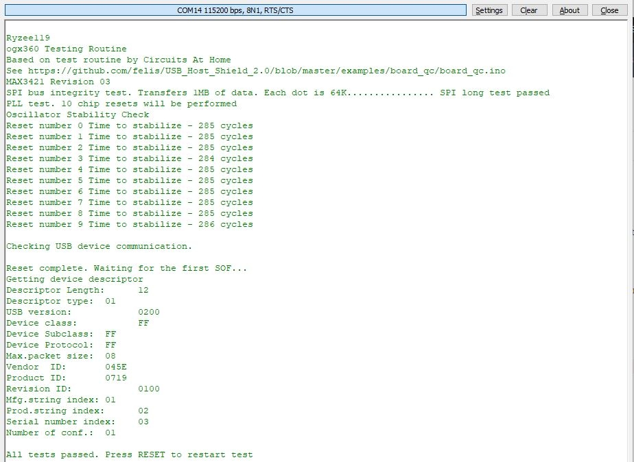

# ogx360 - Firmware

## Programming (Platform IO IDE - Recommended)
* Download and install [Arduino IDE](https://www.arduino.cc/en/software) for the required drivers.
* Setup Visual Studio Code as per the Compiling instructions.
* Press the RESET button on the ogx360 PCB.
* Hit the program button on the Platform IO toolbar (`→`).
* When the console window says `Waiting for the new upload port...` hit the RESET button again.
* Repeat the process for any other modules you need to update.

## Programming (from HEX file)
* Download and install [Arduino IDE](https://www.arduino.cc/en/software) for the required drivers.
* Download [avrdude](http://download.savannah.gnu.org/releases/avrdude/). Windows [download](http://download.savannah.gnu.org/releases/avrdude/avrdude-6.3-mingw32.zip).
* Create a file called `program.bat` in the same folder as `avrdude.exe` and copy this command into it. Note press RESET on the ogx360 and determine what COM number it appears in the device manager and alter the COM17 below as required.
* `avrdude -C avrdude.conf -F -p atmega32u4 -c avr109 -b 57600 -P COM17 -Uflash:w:ogx360.hex:i`
* Press RESET on the ogx360, wait a second then run the bat file.

## Compiling
* Download and install [Arduino IDE](https://www.arduino.cc/en/software) for the required drivers.
* Download and install [Visual Studio Code](https://code.visualstudio.com/).
* Install the [PlatformIO IDE](https://platformio.org/platformio-ide) plugin.
* Clone with git `git clone https://github.com/Ryzee119/ogx360.git --recursive`. Recursively!
* In Visual Studio Code `File > Open Folder... > ogx360/Firmware`
* Hit build on the Platform IO toolbar (`✓`).
* Follow the Programming instructions to program.
* Or see the `.pio/build/` folder for the compiled hex files.

## Testing
If you have made the board yourself and want to check everything is healthy, I have added a test program `ogx360_debug.hex`. Program this to the master module as per the programming instructions under **Programming**.

The module will now appear as a keyboard and serial device in windows. Note the COM port number.

Open a serial monitoring program such as [Termite](https://www.compuphase.com/software_termite.htm), and set the following settings `Baud rate: 115200, 8 Data Bits, 1 Stop Bit, Parity None, Flowing Control RTS/CTS`. Once you connect to the COM Port, the self test should be performed. A healthy board with a Wireless Receiver connected should output the following:

  

## References
* Xbox USB protocol info can be found [here](https://xboxdevwiki.net/Xbox_Input_Devices).
* [USB Host Shield 2.0](https://github.com/felis/USB_Host_Shield_2.0) Library use under the GNU General Public License.
* [Arduino Core](https://github.com/Ryzee119/ArduinoCore-avr) used under the [GNU General Public License/ Lesser GPL](https://github.com/arduino/Arduino/blob/master/license.txt).

By Ryzee119
