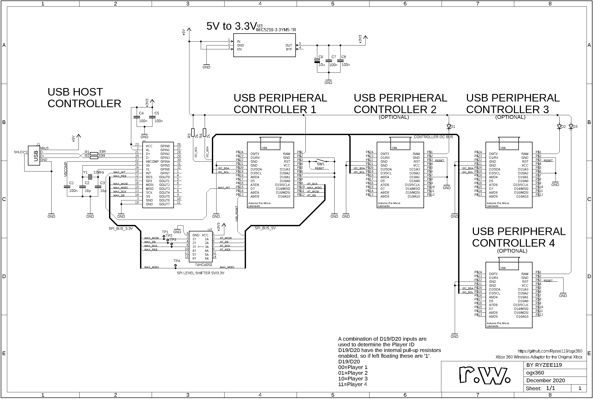

# ogx360 - Hardware
This folder contains the schematic and PCB layout files and the PCB Gerber files. These were created using [Autodesk Eagle.](https://www.autodesk.com/products/eagle/overview)

* The PCB Gerbers and BOM are located [here](../.kitspace/).
* These can easily be ordered via [kitspace](https://kitspace.org/boards/github.com/ryzee119/ogx360).
  * Note: you may wish to order extra of the small components (resistors, capacitors, etc.) as it is easy to loose some when hand-soldering.
* 3D model of the PCB is [here](https://a360.co/3aavAXA) (Fusion360).
* Note: On the corner of the Arduino modules there is a solder jumper labelled J1. It is recommended you bridge this with a solder blob.

## Some other needed items
| Qty | Value/Model | Link|
| --- | --- | --- |
| Up to 4 | ARDUINO_LEONARDO_MICRO 5V/16Mhz | [Any clones](https://www.aliexpress.com/item/New-Pro-Micro-for-arduino-ATmega32U4-5V-16MHz-Module-with-2-row-pin-header-For-Leonardo/32768308647.html). Only one is compulsory. 2,3 and 4 will add support for Player 2,3, 4 respectively. Make sure you get the 5V/16Mhz variant. |
| Up to 4 | Xbox Controller Port to MicroUSB cable | [ChimericSystems](https://www.chimericsystems.com/product/micro-usb-to-xbox-cable/) or [Alibaba (Large MOQ!)](https://www.alibaba.com/product-detail/for-XBOX-MicroUSB-Cable-for-Xbox_62222784495.html) or DIY |

## Cases
If you make a case or something similar I can put it here if you're happy to share!
* By bluemeanie23 at [Tinkercad](https://www.tinkercad.com/things/kJb02GCUetG).
* By culexus at [Thingiverse](https://www.thingiverse.com/thing:3510779?fbclid=IwAR1Hd3BBLBxFbMWYJ0MO9VCzgxWrqV2Efiftj0Rz7HYnv9ODGwWncQdSh4I).

## Schematic

By Ryzee119
