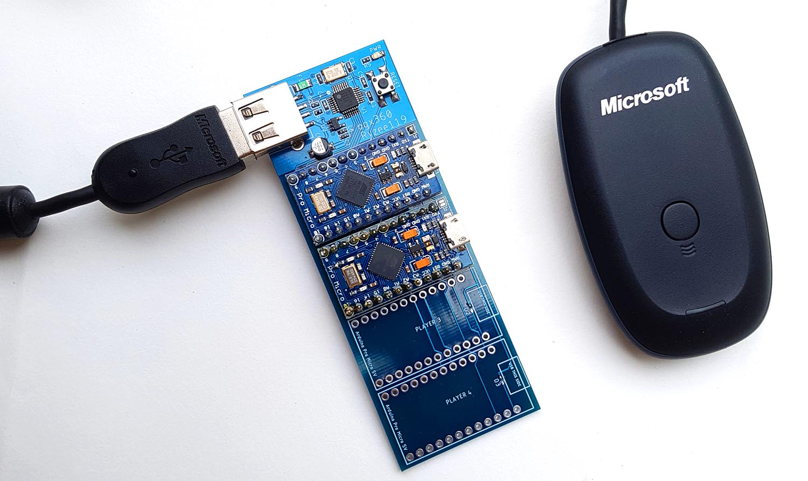

# ogx360 - Overview
  

The ogx360 is a small circuit board which allows you to a range of modern USB controllers on the Original Xbox Console.

* A simple video showing some its feature is on youtube https://youtu.be/ycZjQUjz1Fk
* Another video attempting to show the input lag is here: https://youtu.be/V7Pnba7Y12Y
* Another video showing the Steel Battalion Controller support is here: https://youtu.be/g_eQlOcccg8

  

## Features include:
* Full rumble support on all controllers.
* Steel Battalion controller support on Player 1 with an Xbox 360 Chatpad using Xbox 360 Wireless Controllers.
* Low level programming with minimal input lag. Less than 4ms over an original controller. (See https://youtu.be/V7Pnba7Y12Y)
* Firmware can be updated over USB. No programming hardware is required. See [Firmware](./Firmware).
* One ogx360 mutliple Xboxes, just plug the other Arduino modules into nearby OG Xbox consoles.

## Supported controllers
* Supports 4 players with Genuine and Third Party Microsoft Xbox 360 Wireless Receivers.
* Wired Xbox 360 Controllers.
* 8bitdo Wireless Adaptor (See http://www.8bitdo.com/wireless-usb-adapter/ for supported controllers). One controller per 8bitdo adaptor.
* ChronusMAX (See https://cronusmax.com/ for supported devices). Ensure it is configured to appear as an Xbox 360 Controller. One controller per adaptor.
* Genuine Wired Xbox One Controllers.
* **NOTE** - When connecting multiple USB bus powered devices, an externally powered USB2.0 hub is highly recommended.

## Steel Battalion controller emulation
* You need a wireless Xbox 360 controller with a chatpad peripheral.
* You can change what the controller appears to the console at anytime, so you can use the 'Duke Controller' to boot into the game, then change to the 'Steel Battalion controller' whilst in game. 
* Button mapping is below. (High Res image available [here](https://i.imgur.com/12SawzC.png)).

  

## Connection to your Xbox
  

  

By Ryzee119
